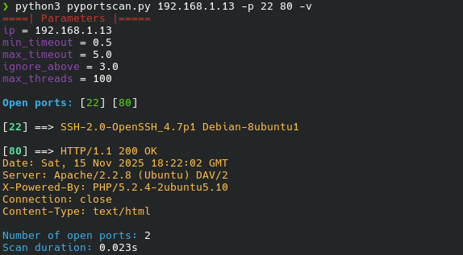

# PyPortScan

 

Hi everyone, this is my first project on GitHub, a simple TCP port scanner wrintten in Python which implements multi-threading, banner grabbing and dynamic timeouts. Various parameters can be set via CLI, by default it will scan a list of common ports.

## Requirements

- Python 3.7 or higher
- Only standard libraries

---

## Usage

```bash
python3 pyportscan.py <target_ip> [parameters]
```
| Flag                      | Description                                    |
|---------------------------|------------------------------------------------|
| `-r`, `--range`           | Scan ports in a given range (`-r 20-100`)      |
| `-p`, `--ports`           | Scan a specific list of ports (`-p 22 80 443`) |
| `-v`, `--verbose`         | Enable verbose output                          |
| `--max-threads`           | Set max number of threads (default: 100)       |
| `--min-timeout`           | Minimum timeout for each port (default: 0.5s)  |
| `--max-timeout`           | Maximum timeout for each port (default: 5.0s)  |
| `--ignore-responses-above`| Ignore response times above this value when calculating dynamic timeout to prevent slow ports from slowing the entire scan (default 3.0s)         |
| `--no-banner-grabbing`    | Disable banner grabbing                        |

## Examples

```bash
# Scan common ports
python3 pyportscan.py 192.168.1.1

# Scan a custom range of ports
python3 pyportscan.py 192.168.1.1 -r 20-100

# Scan specific ports with verbose output
python3 pyportscan.py 192.168.1.1 -p 22 80 443 -v
```

## Sample Output


## ⚠️ Disclaimer ⚠️

This tool is intended **for educational and authorized testing purposes ONLY**.

The author is **not responsible for any misuse** of this tool.  
By using it, you agree to:

- Use it **only on systems you own** or have **explicit permission** to test
- **Comply with all applicable laws and regulations** in your jurisdiction
- Accept full responsibility for your actions

**Unauthorized scanning of networks or devices is illegal and unethical and can put you in serious trouble.**